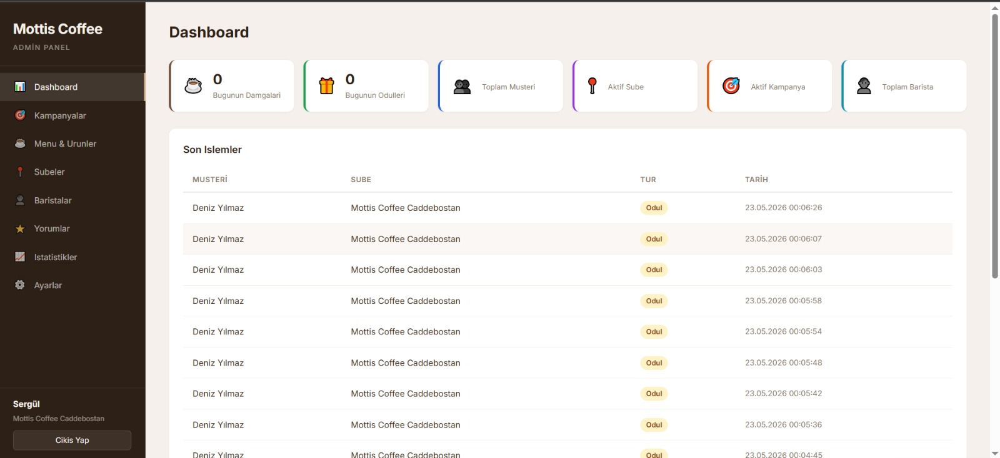
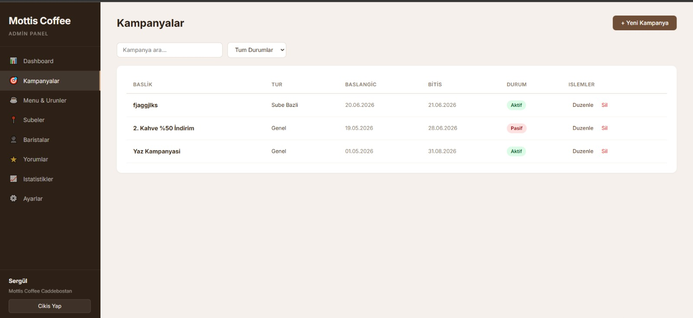
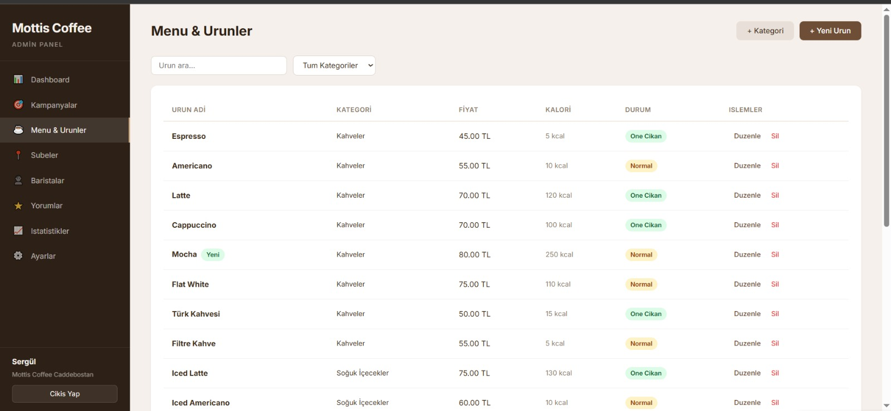
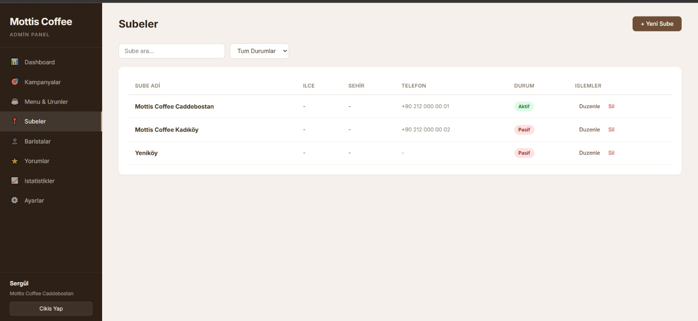
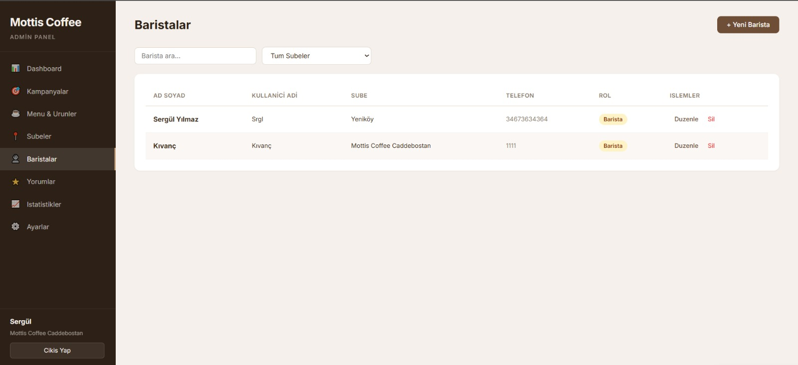
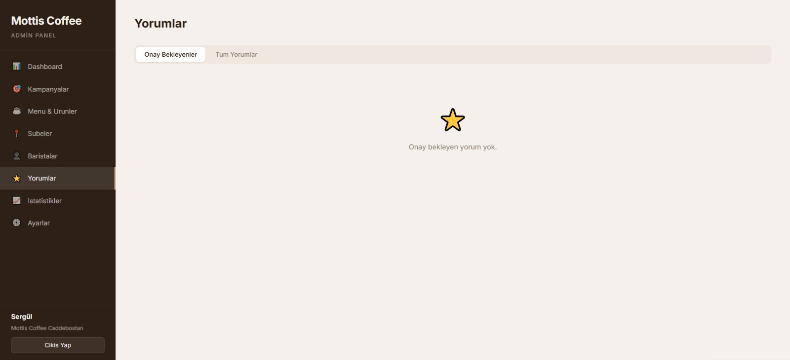
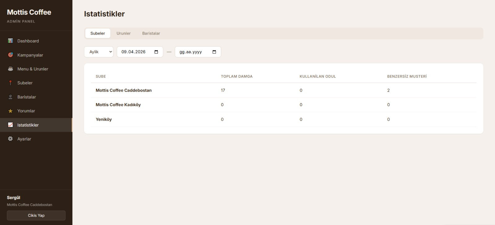
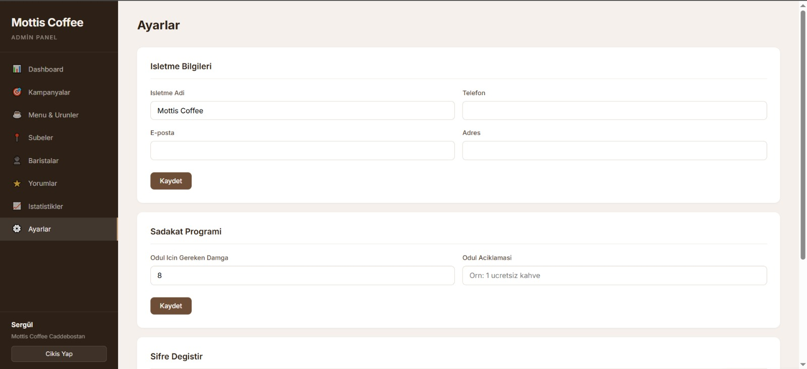

# Mottis Coffee - Sadakat ve Yonetim Sistemi

## Ogrenci Bilgileri

| Bilgi | Detay |
|-------|-------|
| **Ad Soyad** | Sergül Yılmaz |
| **Ogrenci No** | 24010502167 |
| **Ders** | CPP214 |

---

## Proje Amaci ve Aciklamasi

**Mottis Coffee**, kahve dukkanlari icin gelistirilmis kapsamli bir sadakat (loyalty) ve yonetim sistemidir. Sistem, musterilerin kahve alimlarini takip ederek pul toplama ve ucretsiz ikram kazanma imkani sunar. Proje dort ana bilesenden olusmaktadir:

- **Musteri Mobil Uygulamasi** - Musterilerin pul durumunu goruntulemesi, QR kod ile islem yapmasi, magazalari ve menuyu goruntulemesi
- **Barista Mobil Uygulamasi** - Baristalarin musteri QR kodlarini tarayarak pul eklemesi ve gunluk istatistiklerini takip etmesi
- **Admin Paneli** - Yoneticilerin magazalari, personeli, urunleri, kampanyalari ve istatistikleri yonetmesi
- **Backend API** - Tum uygulamalarin baglandigi merkezi sunucu

### Sadakat Sistemi Mantigi
Musteri her kahve aldikca barista QR kodu tarar ve 1 pul eklenir. **8 pul = 1 ucretsiz ikram** kazandirir.

---

## Kullanilan Teknolojiler / Kutuphaneler

### Backend (mottis-backend)
| Teknoloji | Aciklama |
|-----------|----------|
| Node.js + Express.js | REST API sunucusu |
| PostgreSQL | Iliskisel veritabani |
| JWT (jsonwebtoken) | Kimlik dogrulama (access + refresh token) |
| bcryptjs | Sifre hashleme |
| firebase-admin | Push bildirim (FCM) |
| express-validator | Girdi dogrulama |
| dotenv | Ortam degiskenleri |
| nodemon | Gelistirme sunucusu |

### Musteri Uygulamasi (mottis_flutter)
| Teknoloji | Aciklama |
|-----------|----------|
| Flutter / Dart | Cross-platform mobil framework |
| Provider | State management |
| Dio | HTTP istemcisi |
| qr_flutter | QR kod olusturma |
| geolocator | Konum servisleri |
| shared_preferences | Yerel depolama |

### Barista Uygulamasi (mottis-barista)
| Teknoloji | Aciklama |
|-----------|----------|
| Flutter / Dart | Cross-platform mobil framework |
| Provider | State management |
| mobile_scanner | Kamera ile QR kod tarama |
| http | HTTP istemcisi |
| intl | Tarih/saat formatlama |
| shared_preferences | Yerel depolama |

### Admin Paneli (mottis-admin)
| Teknoloji | Aciklama |
|-----------|----------|
| React 19 | Frontend kutuphanesi |
| Vite | Build araci ve dev sunucusu |
| React Router DOM | Sayfa yonlendirme |

---

## Proje Klasor Yapisi

```
mottis-coffee/
├── mottis-backend/          # Node.js REST API
│   ├── src/
│   │   ├── app.js           # Ana uygulama ve route tanimlari
│   │   ├── config/          # Veritabani ve Firebase ayarlari
│   │   ├── middleware/      # JWT auth middleware
│   │   ├── routes/          # API endpointleri
│   │   └── utils/           # QR ve bildirim yardimcilari
│   ├── schema.sql           # Veritabani semasi
│   └── package.json
│
├── mottis_flutter/          # Musteri mobil uygulamasi (Flutter)
│   ├── lib/
│   │   ├── main.dart
│   │   ├── screens/         # Giris, ana sayfa, menu, QR, profil
│   │   ├── services/        # API servisi
│   │   ├── providers/       # Auth state management
│   │   └── widgets/         # Yeniden kullanilabilir bilesenler
│   └── pubspec.yaml
│
├── mottis-barista/          # Barista mobil uygulamasi (Flutter)
│   ├── lib/
│   │   ├── main.dart
│   │   ├── screens/         # Giris, QR tarayici, sonuc, profil
│   │   └── services/        # API ve auth servisleri
│   └── pubspec.yaml
│
├── mottis-admin/            # Admin web paneli (React)
│   ├── src/
│   │   ├── App.jsx          # Ana routing
│   │   ├── pages/           # Dashboard, urunler, kampanyalar vb.
│   │   ├── components/      # Layout, Modal, StatCard
│   │   └── context/         # Auth context
│   └── package.json
│
└── README.md
```

---

## Kurulum Adimlari

### On Kosullar
- Node.js (v18+)
- PostgreSQL (v14+)
- Flutter SDK (v3.29+)
- Git

### 1. Projeyi Klonlama
```bash
git clone https://github.com/sergulyilmaz/mottis-coffee.git
cd mottis-coffee
```

### 2. Veritabani Kurulumu
```bash
# PostgreSQL'de veritabani olusturma
createdb mottis-db

# Semalari yukleme
psql -U postgres -d mottis-db -f mottis-backend/schema.sql
```

### 3. Backend Kurulumu
```bash
cd mottis-backend
npm install

# .env dosyasi olusturma
cp .env.example .env
# .env dosyasindaki degerleri kendi ortaminiza gore duzenleyin

# Sunucuyu baslatma
npm run dev
```

### 4. Admin Paneli Kurulumu
```bash
cd mottis-admin
npm install
npm run dev
# http://localhost:5173 adresinde acilir
```

### 5. Flutter Uygulamalari Kurulumu
```bash
# Musteri uygulamasi
cd mottis_flutter
flutter pub get
flutter run

# Barista uygulamasi
cd mottis-barista
flutter pub get
flutter run
```

---

## Calistirma / Kullanim Talimatlari

### Sistemi Baslatma Sirasi
1. PostgreSQL servisinin calistiginden emin olun
2. Backend sunucusunu baslatin (`npm run dev` - port 3000)
3. Admin panelini baslatin (`npm run dev` - port 5173)
4. Flutter uygulamalarini emulatorde veya fiziksel cihazda calistirin

### Kullanici Rolleri
| Rol | Uygulama | Yetenekler |
|-----|----------|------------|
| **Musteri** | Flutter (mottis_flutter) | Kayit olma, QR gosterme, pul takibi, menu goruntuleme |
| **Barista** | Flutter (mottis-barista) | QR tarama, pul ekleme, gunluk istatistik |
| **Admin/Yonetici** | Web (mottis-admin) | Magaza, personel, urun, kampanya yonetimi |

### Sadakat Akisi
1. Musteri uygulamada QR kodunu acar
2. Barista, musteri QR kodunu tarar
3. Sisteme 1 pul eklenir
4. 8 pul biriktiginde otomatik olarak 1 ucretsiz ikram hakki tanimlanir

---

## Ekran Goruntuleri

### Admin Panel - Dashboard


### Admin Panel - Kampanyalar


### Admin Panel - Menu & Urunler


### Admin Panel - Subeler


### Admin Panel - Baristalar


### Admin Panel - Yorumlar


### Admin Panel - Istatistikler


### Admin Panel - Ayarlar


---

## GitHub Proje Baglantisi

> **GitHub:** [https://github.com/sergulyilmaz/mottis-coffee](https://github.com/sergulyilmaz/mottis-coffee)

---

## Veritabani Semasi

Projede asagidaki tablolar kullanilmaktadir:

| Tablo | Aciklama |
|-------|----------|
| `stores` | Magaza bilgileri (konum, calisma saatleri) |
| `customers` | Musteri bilgileri ve tercihleri |
| `staff` | Barista ve yonetici bilgileri |
| `stamps` | Pul kayitlari (her kahve alimi) |
| `rewards` | Kazanilan ucretsiz ikramlar |
| `campaigns` | Kampanya ve promosyonlar |
| `reviews` | Musteri degerlendirmeleri |
| `support_tickets` | Destek talepleri |

---

## API Endpointleri

| Yol | Aciklama |
|-----|----------|
| `POST /auth/register` | Musteri kayit |
| `POST /auth/login` | Musteri giris |
| `POST /staff/login` | Personel giris |
| `GET /me` | Musteri profili |
| `GET /menu` | Menu listesi |
| `POST /stamps` | Pul ekleme (barista) |
| `GET /stores` | Magaza listesi |
| `GET /campaigns` | Kampanyalar |
| `GET /admin/*` | Yonetim islemleri |

---

## Kaynakca ve Yararlanilan Baglantilar

- [Node.js Resmi Dokumantasyonu](https://nodejs.org/docs)
- [Express.js Rehberi](https://expressjs.com/)
- [Flutter Resmi Dokumantasyonu](https://docs.flutter.dev/)
- [React Resmi Dokumantasyonu](https://react.dev/)
- [PostgreSQL Dokumantasyonu](https://www.postgresql.org/docs/)
- [JWT.io - JSON Web Token](https://jwt.io/)
- [Firebase Cloud Messaging](https://firebase.google.com/docs/cloud-messaging)
- [Provider State Management](https://pub.dev/packages/provider)
- [Dio HTTP Client](https://pub.dev/packages/dio)
- [Mobile Scanner](https://pub.dev/packages/mobile_scanner)
